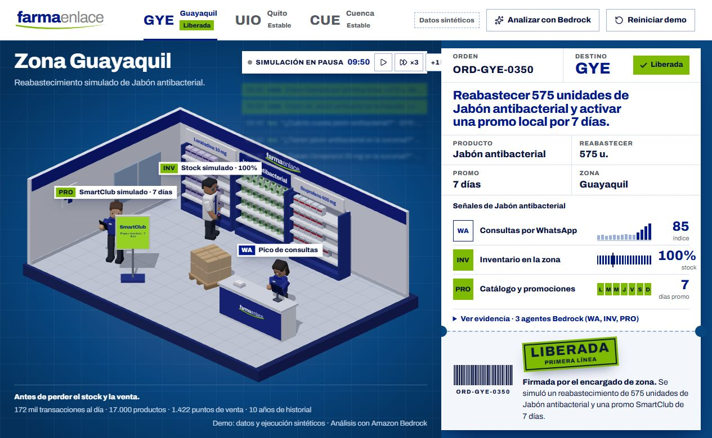

# Verificación AWS — Sales Coworker

Fecha: **8 de octubre de 2026**. Entorno: cuenta temporal AWS del workshop, región `us-east-1`. Datos exclusivamente sintéticos.

**Resultado: demo pública operativa y flujo remoto completo verificado.**

[Abrir demo](https://d3d0kckkr3hkmr.cloudfront.net) · [Arquitectura y operación](../README.md)

## Entrega desplegada

- Pila CloudFormation en estado `CREATE_COMPLETE`.
- Frontend Next.js exportado y servido por Nginx mediante HTTPS/CloudFront y ALB.
- Convex self-hosted en EC2: esquema y funciones publicados, datos persistentes en volumen del servidor. No se usa Convex Cloud.
- Amazon Bedrock invocado desde el backend mediante el rol IAM de EC2.
- S3 privado para artefactos y Systems Manager para operación del servidor.

## Pruebas y resultados

| Comprobación | Resultado |
| --- | --- |
| Batería automatizada | 38/38 casos correctos: 25 Bedrock, 11 decisiones y 2 control global de solicitudes |
| TypeScript | Correcto |
| Compilación del frontend con origen AWS | Correcta |
| Navegador | Maqueta 3D y tablero reactivo cargan desde la URL pública |
| Botón «Analizar con Bedrock» | Completa tres agentes desde la interfaz; con inventario al 100% no crea otra reposición |
| Primer análisis remoto | Tres agentes reales; 25,377 segundos |
| Segundo análisis remoto | Tres agentes reales; 22,302 segundos |
| Decisiones repetidas | Rechazo y aprobación idempotentes |
| Cliente nuevo | Recupera ambas decisiones y el inventario final |
| Reinicio del contenedor backend | Conserva ambas decisiones y el inventario al 100% |

La prueba remota se ejecutó entre **16:21:45 y 16:22:38, hora de Ecuador**. Selección: **Guayaquil / FE-JAB / Jabón antibacterial**.

| Paso | Inventario | Resultado |
| --- | --- | --- |
| Inicio | 185 de 760 unidades, 24% | Condición de reposición |
| Primer análisis | 185 de 760 | Propone 575 unidades sin modificar existencias |
| Rechazo y repetición | 185 de 760 | No repone ni duplica efectos |
| Segundo análisis | 185 de 760 | Nueva propuesta de 575 unidades |
| Aprobación y repetición | 760 de 760, 100% | Repone una sola vez |
| Cliente nuevo y reinicio del backend | 760 de 760, 100% | Decisiones e inventario persistentes |

La corrida terminó con `success: true` y dejó pausada la simulación para conservar evidencia revisable. Otros usuarios pueden modificar posteriormente este escenario compartido.

Una prueba real previa de los tres agentes contra Nova Lite completó 10 solicitudes con una espera mínima observada de **1,101 segundos entre una respuesta y la solicitud siguiente**. El código aplica exclusión global y espera de 1,1 segundos; sus casos automatizados cubren concurrencia y recuperación de una solicitud abandonada.

## Conjunto sintético importado

Se importaron las ocho tablas del conjunto de demostración, incluida su metadata, y se reconstruyeron los indicadores.

| Contenido | Conteo verificado |
| --- | ---: |
| Productos | 16 |
| Sucursales | 48 |
| Mensajes | 3.930 |
| Mensajes entrantes | 3.322 |
| Agregados diarios WhatsApp | 1.054 |
| Posiciones de inventario | 768 |
| Promociones | 63 |
| Noticias sintéticas | 18 |
| Indicadores derivados | 48 |

## Reproducir la comprobación

```powershell
npm test
npm run typecheck
npm run build
npm run test:aws
```

`test:aws` requiere el origen público y la clave administrativa self-hosted en `.env.local`. Hace llamadas reales a Bedrock y modifica únicamente el escenario sintético: realiza dos análisis, rechazo, aprobación y comprobación de persistencia con un cliente nuevo. El reporte detallado se guarda en `.local/aws-smoke.json`, excluido de Git. El reinicio del contenedor y la comprobación visual del navegador son verificaciones adicionales, no pasos del script.

## Límites de esta evidencia

Las acciones de aprobar/rechazar se verificaron mediante el cliente HTTP contra el backend público. La carga visual se revisó en navegador; este informe no certifica un recorrido manual de todos sus botones. Tampoco demuestra autenticación por sucursal, integraciones reales con WhatsApp/SAP/SmartClub, impacto comercial medido, alta disponibilidad ni recuperación ante pérdida del volumen.



Las 38 pruebas actuales no equivalen a la batería Q01–Q12 del intérprete Python anterior. Los resultados legacy de 8/12 y 47/60 pertenecen a otro contrato y otra implementación.

La permanencia de la URL y los datos depende de la cuenta temporal del workshop.
